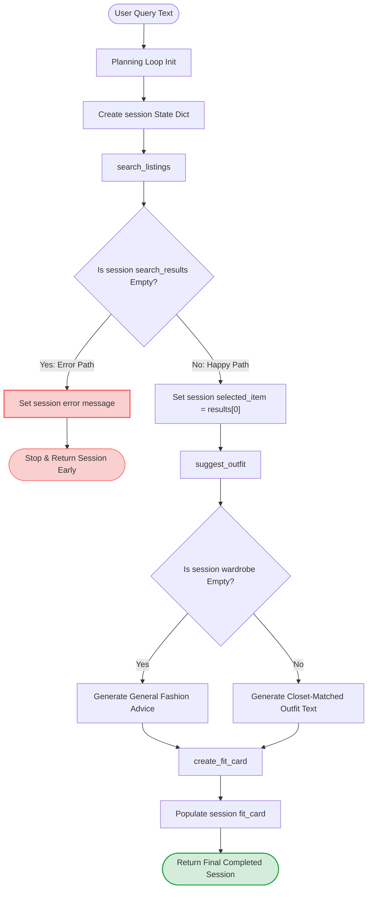

# FitFindr — planning.md

> Complete this document before writing any implementation code.
> Your spec and agent diagram are what you'll use to direct AI tools (Claude, Copilot, etc.) to generate your implementation — the more specific they are, the more useful the generated code will be.
> Your planning.md will be reviewed as part of your submission.
> Update it before starting any stretch features.

---

## Tools

List every tool your agent will use. For each tool, fill in all four fields.
You must have at least 3 tools. The three required tools are listed — add any additional tools below them.

### Tool 1: search_listings

**What it does:**
<!-- Describe what this tool does in 1–2 sentences -->
Search the mock listings dataset for items matching the description, optional size, and optional price ceiling.
**Input parameters:**
<!-- List each parameter, its type, and what it represents -->
- `description` (str):  Keywords describing what the user is looking for (e.g., "vintage graphic tee")
- `size` (str): Size string to filter by, or None to skip size filtering. Matching is case-insensitive (e.g., "M" matches "S/M").
- `max_price` (float): Maximum price (inclusive), or None to skip price filtering.

**What it returns:**
<!-- Describe the return value — what fields does a result contain? -->
A list of matching listing dicts, sorted by relevance (best match first).
**What happens if it fails or returns nothing:**
<!-- What should the agent do if no listings match? -->
Returns an empty list — does NOT raise an exception.
---

### Tool 2: suggest_outfit

**What it does:**
<!-- Describe what this tool does in 1–2 sentences -->
Leverages an LLM via Groq to construct 1–2 personalized outfit styling recommendations by pairing a newly discovered marketplace listing item with the clothes already inside the user's closet.
**Input parameters:**
<!-- List each parameter, its type, and what it represents -->
- `new_item` (dict):  A listing dict (the item the user is considering buying).
- `wardrobe` (dict): A wardrobe dict with an 'items' key containing a list of wardrobe item dicts.

**What it returns:**
<!-- Describe the return value -->
A non-empty string with outfit suggestions.
**What happens if it fails or returns nothing:**
<!-- What should the agent do if the wardrobe is empty or no outfit can be suggested? -->
It offer general styling advice for the item rather than raising an exception or returning an empty string.
---

### Tool 3: create_fit_card

**What it does:**
<!-- Describe what this tool does in 1–2 sentences -->
Generate a short, shareable outfit caption for the thrifted find.
**Input parameters:**
<!-- List each parameter, its type, and what it represents -->
- `outfit` (str):  The outfit suggestion string from suggest_outfit().
- `new_item` (dict): The listing dict for the thrifted item.
**What it returns:**
<!-- Describe the return value -->
A 2–4 sentence string usable as an Instagram/TikTok caption.
**What happens if it fails or returns nothing:**
<!-- What should the agent do if the outfit data is incomplete? -->
Return a descriptive error message string — do NOT raise an exception.
---

### Additional Tools (if any)

<!-- Copy the block above for any tools beyond the required three -->

---

## Planning Loop

**How does your agent decide which tool to call next?**
<!-- Describe the logic your planning loop uses. What does it look at? What conditions change its behavior? How does it know when it's done? -->
- The loop starts by initialization, it creates a state object using `_new_session(query, wardrobe)`. Then parsing stage where the loop extracts unstructured string parameters from the raw query and updates `session["parsed"]`.
- Then it move to search evaulation where the agent executes `search_listings()` using the parsed filters. It evaulates the resulting array stored in `session["search_results"]`.
     - Empty branch: If the length of the results array is 0, the loop updates `session["error"]` with an actionable system alert and returns the session dictionary immediately. Excution terminates.
     - Valid branch: If the length is greater than 0, the agent assigns `session["selected_item"] = session["searcg_results"][0]` and transitions to styling evaluation.
- In the styling evaulation the agent calls `suggets_outfit()` using the selected item and wardrobe data. The resulting text is bound directly to `session["outfit_suggestion"]`. The loop immediately proceeds to caption evaulation.
- In Caption Evaulation the agent runs `create_fit_card()` with the newly added outfit text and item parameters, sorting the final output string in `session["fit_card"]`.
Finally, the agent returns the entire session dictionary structure.
---

## State Management

**How does information from one tool get passed to the next?**
<!-- Describe how your agent stores and accesses state within a session. What data is tracked? How is it passed between tool calls? -->
The agent uses a single Python dictionary called `session` as its master notebook. This dictionary is the "single source of truth" and stays alive during the entire user interaction to store and share data automatically between tools.

Step-by-step without requiring any extra user input:
- **`session["query"]` and `session["wardrobe"]`**: Saved at the very beginning when `_new_session` is called.
- **`session["parsed"]`**: Holds the extracted filter details from the query text. The agent reads this box to pass the parameters directly into `search_listings()`.
- **`session["selected_item"]`**: When `search_listings()` finds a list of clothes, the agent takes the top item dictionary from `session["search_results"]` and saves it here.
- **Passing to Tool 2**: The agent calls `suggest_outfit()` by pulling `session["selected_item"]` and `session["wardrobe"]` straight out of the notebook. The user doesn't have to re-enter anything.
- **`session["outfit_suggestion"]`**: The text generated by `suggest_outfit()` is saved in this box.
- **Passing to Tool 3**: The agent calls `create_fit_card()` by pulling the text from `session["outfit_suggestion"]` and the item details from `session["selected_item"]`.
- **`session["error"]`**: Starts as `None`. If any tool fails or returns zero results, this is updated with a helpful message, which signals the agent to stop immediately.
---

## Error Handling

For each tool, describe the specific failure mode you're handling and what the agent does in response.

| Tool | Failure mode | Agent response |
|------|-------------|----------------|
| **search_listings** | No items in the catalog match the user's keywords, size, or price constraints. | The agent immediately halts the entire planning loop. It writes a specific message to `session["error"]`: *"No listings found matching your constraints. Try loosening your price limit or changing your search terms!"* It exits the function early and does not call any other tools. |
| **suggest_outfit** | The user has no clothes in their digital closet (`wardrobe["items"]` is completely empty). | The agent does **not** fail or stop. Instead, it adjusts its strategy and directs the Groq LLM to generate general fashion styling guidelines for the new item (e.g., advising what universal colors, shapes, or aesthetics pair best with it) instead of matching it with specific closet pieces. |
| **create_fit_card** | The text input from `suggest_outfit` is missing, completely empty, or filled only with blank spaces. | The agent catches this empty data string before making an unnecessary API call. It skips the LLM generation entirely and returns a safe, helpful fallback message: *"Unable to generate your Fit Card because outfit data was missing. Please double-check your search and try again!"* |

---

## Architecture

<!-- Draw a diagram of your agent showing how the components connect:
     User input → Planning Loop → Tools (search_listings, suggest_outfit, create_fit_card)
                                                                          ↕
                                                                   State / Session
     Show what triggers each tool, how state flows between them, and where error paths branch off.
     ASCII art, a Mermaid diagram (https://mermaid.js.org/syntax/flowchart.html), or an embedded
     sketch are all fine. You'll share this diagram with an AI tool when asking it to implement
     the planning loop and each individual tool. -->

---

## AI Tool Plan

<!-- For each part of the implementation below, describe:
     - Which AI tool you plan to use (Claude, Copilot, ChatGPT, etc.)
     - What you'll give it as input (which sections of this planning.md, your agent diagram)
     - What you expect it to produce
     - How you'll verify the output matches your spec before moving on

     "I'll use AI to help me code" is not a plan.
     "I'll give Claude my Tool 1 spec (inputs, return value, failure mode) and ask it to implement
     search_listings() using load_listings() from the data loader — then test it against 3 queries
     before trusting it" is a plan. -->

**Milestone 3 — Individual tool implementations:**
- **AI Tool:** Claude 3.5 Sonnet (with Plan Mode enabled)
- **Inputs to Provide:** I will toggle Claude into Plan Mode and provide the completed `## Tools` section from this `planning.md` file along with the `utils/data_loader.py` file structures. 
- **Expected Production:** I expect Claude to first output a architectural plan outlining its helper function strategies, regex extraction bounds, and Groq API mock calls. Once I approve the plan, it will generate the complete, type-hinted code for `search_listings`, `suggest_outfit`, and `create_fit_card` inside `tools.py`.
- **Verification Strategy:** I will manually verify that the planned fallback states (handling an empty wardrobe) use custom prompt injections for general styling text rather than failing out. After execution, I will run standalone `pytest` unit tests targeting the search scoring loop and the error parameters to confirm it catches edge cases cleanly.

**Milestone 4 — Planning loop and state management:**
- **AI Tool:** Claude 3.5 Sonnet (with Plan Mode enabled)
- **Inputs to Provide:** I will initiate a new Plan Mode session and paste the complete `## Planning Loop` logic requirements, the easy English `## State Management` source-of-truth rules, and our verified `## Architecture` Mermaid workflow diagram. I will also include the current skeleton code of `agent.py`.
- **Expected Production:** An explicit step-by-step pseudo-code design tracing how a query mutates the session state dictionary, followed by the finalized implementation of the `run_agent()` pipeline block.
- **Verification Strategy:** I will review Claude's initial structural breakdown to confirm it checks the array length of `session["search_results"]` before calling downstream tools. Finally, I will run the built-in CLI checks (`python agent.py`) to visually confirm that standard queries generate successful artifacts while invalid budget queries hit the clean early termination error path.
---

## A Complete Interaction (Step by Step)

Write out what a full user interaction looks like from start to finish — tool call by tool call. Use a specific example query.

**Example user query:** "I'm looking for a vintage graphic tee under $30. I mostly wear baggy jeans and chunky sneakers. What's out there and how would I style it?"

**Step 1:**
The agent initializes the entire interaction sequence by calling `_new_session(query, wardrobe)`. This takes the user's raw text string (`query`) and their personal clothing data dictionary (`wardrobe`) extracted from the data loader, returning a fresh, central session dictionary tracking state.

**Step 2:**
The agent parses the user's natural language request string to extract structured values: `description="vintage graphic tee"`, `size="M"` (or `None` if unspecified), and `max_price=30.0`. It saves these mapped attributes directly into the tracking dictionary under `session["parsed"]`.

**Step 3:**
The agent calls `search_listings(description, size, max_price)` using the input variables it just saved in `session["parsed"]`. The tool scans the database and returns a list of matching item dictionaries saved to `session["search_results"]`. 

If the list is empty, the planning loop forks to the error path: it sets a helpful text warning inside `session["error"]` and exits early, completely bypassing the downstream tools. If items are found, it automatically assigns the top item match to `session["selected_item"]` (e.g., a dictionary representing a *Faded Band Tee for $22*).

**Step 4:**
Without requiring the user to re-enter any data, the agent automatically passes the newly stored item and user closet data forward by calling `suggest_outfit(new_item, wardrobe)`. It pulls `session["selected_item"]` and `session["wardrobe"]` straight out of session state. The tool returns a descriptive outfit suggestion text string (e.g., *"Pair this with your wide-leg jeans and platform Docs"*), which is saved into `session["outfit_suggestion"]`.

**Step 5:**
The agent passes both the generated styling advice and product data to the final layout engine by calling `create_fit_card(outfit, new_item)`. It pulls `session["outfit_suggestion"]` and `session["selected_item"]` directly from session state. The tool processes these inputs and returns a finalized social media caption string layout, saving it to `session["fit_card"]`.

**Final output to user:**
On a successful run, the user is presented with the final contents of the updated session dictionary: the chosen marketplace item name and price (`session["selected_item"]`), the personalized styling description (`session["outfit_suggestion"]`), and the completed social media draft text (`session["fit_card"]`). 

If the search catalog returned zero matches, the user only sees a clear, actionable error instruction (`session["error"]`) explaining that no listings matched their filters and suggesting they adjust their terms or budget constraints.